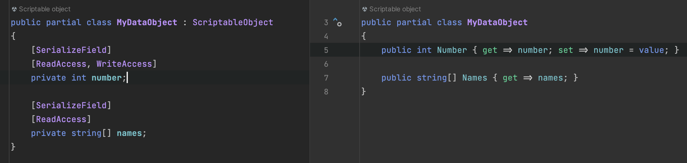

# Accessors Generator

Generates property getters and setters for fields marked with `ReadAccess` and `WriteAccess` attributes.

## Usage

Add the respective attribute to generate the public accessors for **fields**:

|     Attribute | Accessor  |
|--------------:|:----------|
|  `ReadAccess` | Getter    |
| `WriteAccess` | Setter    |

## Code Style Conventions

The fields can only be converted to properties by enforcing capitalization conventions:

- The field name must start with a lowercase letter
- Supported prefixes: `m_`, `_`

Examples:

| Field Name | Property Name |
|-----------:|:--------------|
|   `Nnmber` | `Number`      |
|  `_number` | `Number`      |
| `m_number` | `Number`      |
| `m_Number` | `Number`      |

Unsupported field names:
`Number, _Number, kNumber, k_Number, c_Number`