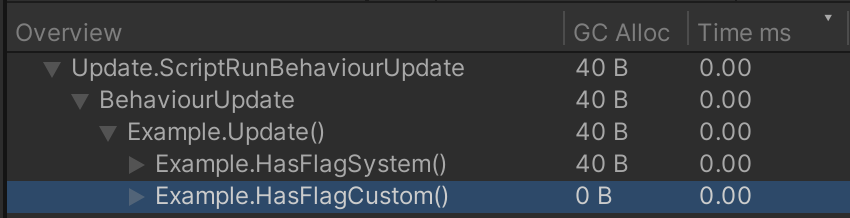

# Enum HasFlag Generator

Adds the extension method `HasFlagNonAlloc` to user-defined enums.
This custom method provides improved performance compared to `System.Enum.HasFlag` by avoiding boxing allocations.



## Usage

To generate the extension code for **enums**:

- Declare the `PandorityTarget` attribute on every assembly that should be visible to the generator
- Apply the `System.Flags` attribute to the desired enum types

### Example

```csharp
[assembly: PandorityTarget]

[System.Flags]
public enum Element
{
    Fire = 1,
    Water = 2,
    Earth = 4,
    Air = 8,
}

public class GettingStarted
{
    public GettingStarted()
    {
        Element element = Element.Fire | Element.Earth;
        bool hasFire = element.HasFlagNonAlloc(Element.Fire);
        bool hasWater = element.HasFlagNonAlloc(Element.Water);
        bool hasEarth = element.HasFlagNonAlloc(Element.Earth);
        bool hasAir = element.HasFlagNonAlloc(Element.Air);
    }
}
```

Alternatively, to specify multiple assemblies in one place, create a file named `Config.Pandority.additionalfile`
in the Unity Assets folder and list the assembly names, one per line.

```.additionalfile
MyAssemblyName
Unity.2D.Common.Runtime
UnityEngine.UI
```

## Limitations

The generated extension method is named `HasFlagNonAlloc` instead of `HasFlag` to avoid being hidden
by the builtin `System.Enum.HasFlag` instance method. In C#, instance methods take precedence over extension methods.
However, consider that the new name is also clearer about the fact that it is a performance optimization.