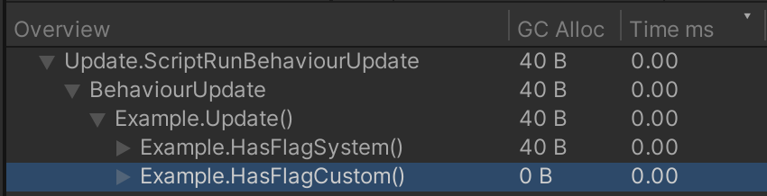

# Pandority

A Roslyn source generator for Unity projects, which adds the extension method `HasFlagNonAlloc` to user-defined enums.
This custom method provides improved performance compared to `System.Enum.HasFlag` by avoiding boxing allocations.



## Requirements

**To use**

- Unity 2021.3 or newer

**To develop**

- JetBrains Rider or Visual Studio
- Consult the [Unity documentation](https://docs.unity3d.com/2021.3/Documentation/Manual/roslyn-analyzers.html)

## Usage

Install the package to your Unity project.
The source generator will automatically generate code for enums that match the following criteria:

- Must be within a namespaces that starts with `Com.InnoGames`
- Must have the `System.Flags` attribute applied

**Example**

```
namespace Com.InnoGames
{
    [System.Flags]
    public enum Element
    {
        Fire = 1,
        Water = 2,
        Earth = 4,
        Air = 8,
    }

    public class GettingStarted
    {
        public GettingStarted()
        {
            Element element = Element.Fire | Element.Earth;
            bool hasFire = element.HasFlagNonAlloc(Element.Fire);
            bool hasWater = element.HasFlagNonAlloc(Element.Water);
            bool hasEarth = element.HasFlagNonAlloc(Element.Earth);
            bool hasAir = element.HasFlagNonAlloc(Element.Air);
        }
    }
}
```

## Limitations

The generated extension method is named `HasFlagNonAlloc` instead of `HasFlag` to avoid being hidden
by the builtin `System.Enum.HasFlag` instance method. In C#, instance methods take precedence over extension methods.
However, consider that the new name is also clearer about the fact that it's a performance optimization.

## Development

Run `nuget restore` to install the required NuGet packages.

Before building the project, review the .csproj file and
ensure that the configuration matches the oldest supported Unity version.
The project is set up to automatically copy the built DLL to the Unity package directory.
